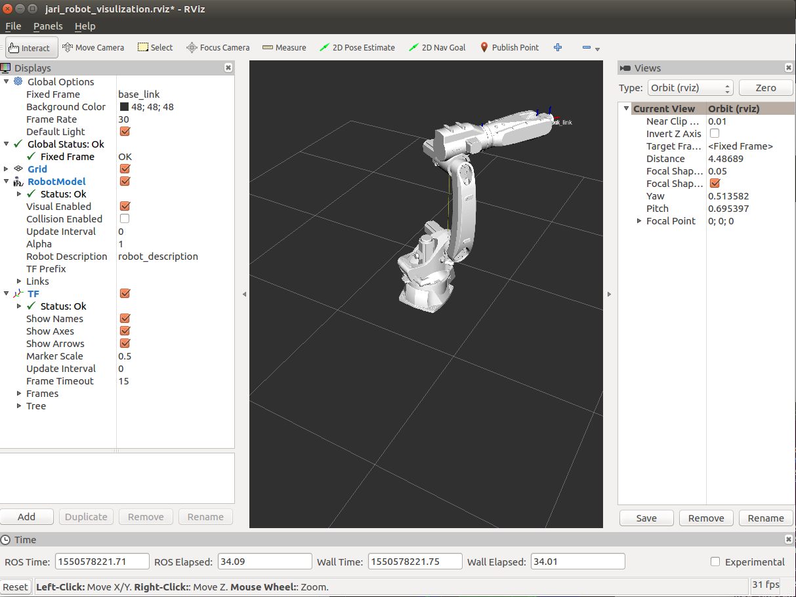
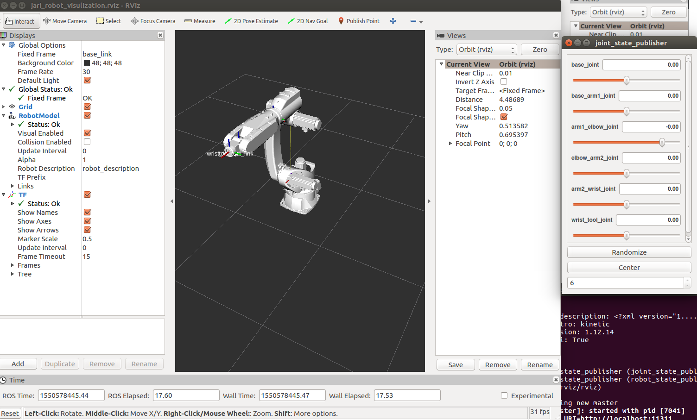
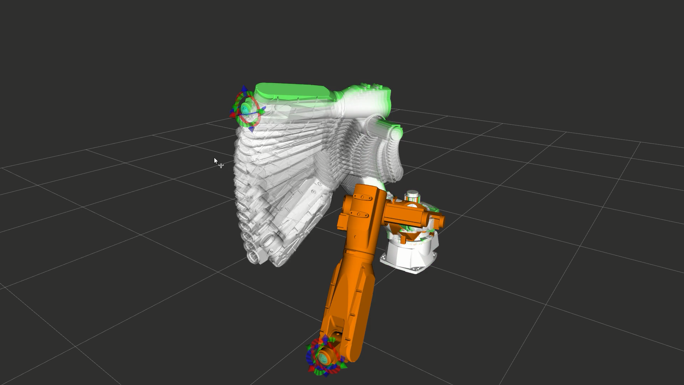
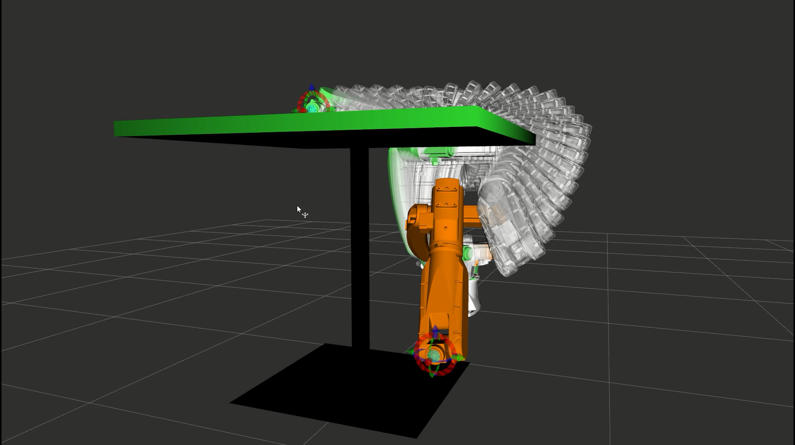

# JARI_ROBOT_ROS

## About
This is ros package for jari robot.

## Environment
+ Ubuntu 16.04
+ ROS Kinetic
  + Install -> [Link](http://wiki.ros.org/kinetic/Installation/Ubuntu), [China Mirrors](http://wiki.ros.org/ROS/Installation/UbuntuMirrors) are suggested.
  + Tutorial -> [Link](http://wiki.ros.org/ROS/Tutorials)

+ Moveit Motion Plan Framework
  + Tutorial -> [Link](http://docs.ros.org/kinetic/api/moveit_tutorials/html/index.html)
  + You also need to install [trac_ik package](http://docs.ros.org/kinetic/api/moveit_tutorials/html/doc/trac_ik/trac_ik_tutorial.html) and [ik_fast](http://docs.ros.org/kinetic/api/moveit_tutorials/html/doc/ikfast/ikfast_tutorial.html) inverse kinematic solver if you want to use besides default kdl solver. A [problem](https://github.com/ros/collada_urdf/issues/8) about using ik_fast is encountered in my work. trac_ik solver is suggested for this package.

+ IDEs:
  + Pycharm for python
  + QT for c++
  + This [page](http://wiki.ros.org/IDEs) collects experience and advice on using integrated development environments (IDEs)

## Usage

Download and put the package in` ~/catkin_ws/src`, then make:
```bash
cd ~/catkin_ws
catkin_make
```
### jari_robot_12kg_description
This is the robot visualization package, the robot model is created in urdf and xacro format, which can be found in `jari_robot_description/urdf`and`jari_robot_description/xacro`.

to play with the model, try:

```bash
roslaunch jari_robot_12kg_description jari_robot_12kg_xacro_rviz.launch
```

the robot will rotate about base joint:



you can also try:

```bash
roslaunch jari_robot_12kg_description jari_robot_12kg_urdf_rviz.launch 
```

in this way you can move the robot with a joint slider panel:



## jari_robot_12kg_moveit_config

this is the moveit motion plan package, it is suggested that go through moveit tutorial and then check about this package.





## Other

Work still in progress.